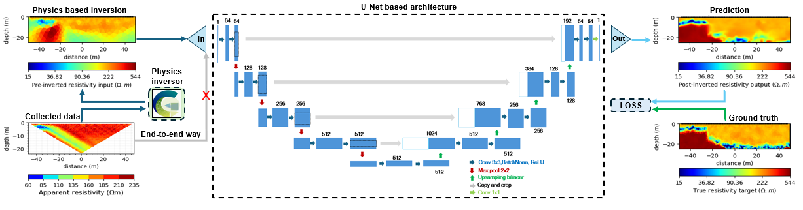
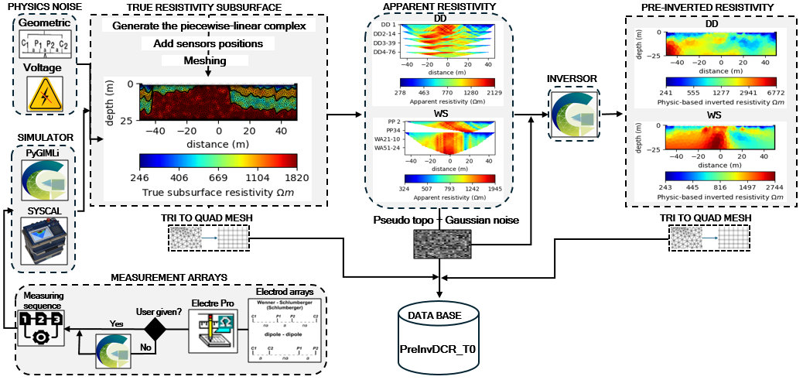
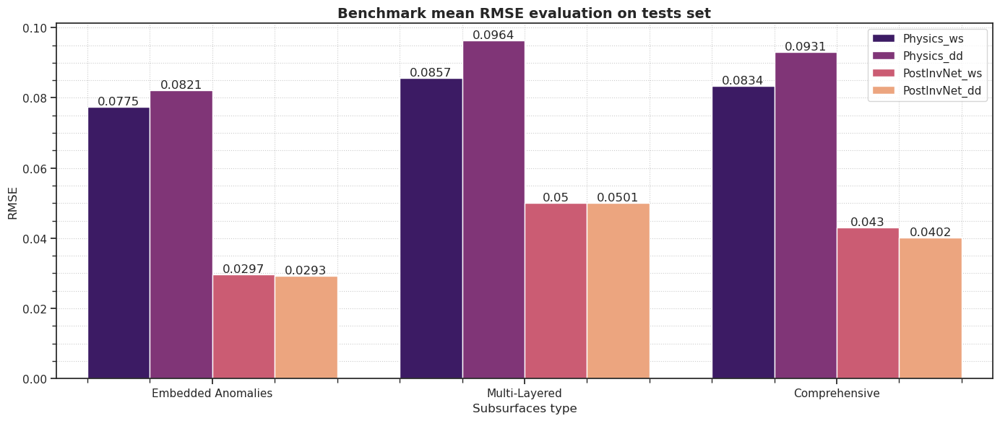
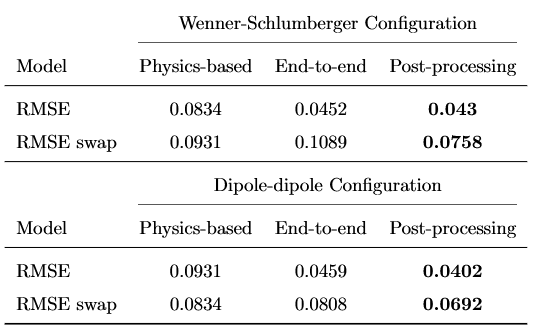

# Neural Post-Processing of Physics-Based 2-D ERT Inversion

This repository provides the implementation for data generation, neural network models, training procedures, and tutorial notebooks demonstrating how to use them for training and prediction, as described in the paper Neural Post-Processing of Physics-Based 2-D ERT Inversion.

In this work, we introduce a lightweight U-Net–based post-processing network designed to enhance physics-based pre-inverted resistivity sections.



## Data generation 

To support efficient training, we constructed a large-scale and realistic database for Dipole-dipole and Wenner-Schlumberger measurement configurations. The dataset can be regenerated using the code provided in this repository. Alternatively, a pre-generated and compressed version can be downloaded from the link:



## Quantitative results

The predictive performance of the proposed post-processing framework was first evaluated on controlled synthetic experiments. We report the root mean square error (RMSE) between the reconstructed and true resistivity sections, averaged over the full test set. The comparison is performed against physics-based inversion across three geological scenarios: (i) simple structures, (ii) complex multi-layered subsurfaces, and (iii) mixed settings. In all cases, the proposed post-processing strategy reduces the mean RMSE by approximately a factor of two relative to physics-based inversion.



We further benchmark the framework against state-of-the-art end-to-end learning approaches. Particular emphasis is placed on robustness with respect to acquisition configuration. Specifically, networks are trained using data generated from a given electrode array configuration (e.g., Dipole–Dipole or Wenner–Schlumberger), and are then evaluated on data generated from a different acquisition configuration. This cross-configuration evaluation, denoted RMSE_swap, quantifies the degradation in reconstruction accuracy when the measurement array used at inference differs from that used during training.

<p align="center">
  
</p>

## Qaulitative results

The proposed framework also demonstrates practical relevance on both synthetic and real field data. In synthetic experiments, the network-enhanced resistivity sections exhibit improved structural delineation, sharper anomaly boundaries, and enhanced recovery of subsurface features compared with conventional physics-based inversion, while remaining consistent with the forward-modelled apparent resistivities.


The methodology was further evaluated on real data acquired at the Collonges-au-Mont-d’Or site. In this case, the post-processed resistivity sections show improved spatial coherence and better agreement with borehole lithology compared with the baseline physics-based inversion, without introducing inconsistencies with the measured apparent resistivities.


## Citation 

If you use this code, dataset, or build upon the proposed methodology, please cite our paper:
```bibtex
@article{postInv2026,
  title   = {Neural Post-Processing of Physics-Based 2-D ERT Inversion},
  author  = {B.O. Ekore, J. Deparis, J. Mille, M. Hidane, P. Kessouri, F. Smai},
  journal = {Geophysical Journal International},
  year    = {2026},
  volume  = {XX},
  number  = {X},
  pages   = {XXX--XXX},
  doi     = {XX.XXXX/gji/xxxxxx}
}
```
